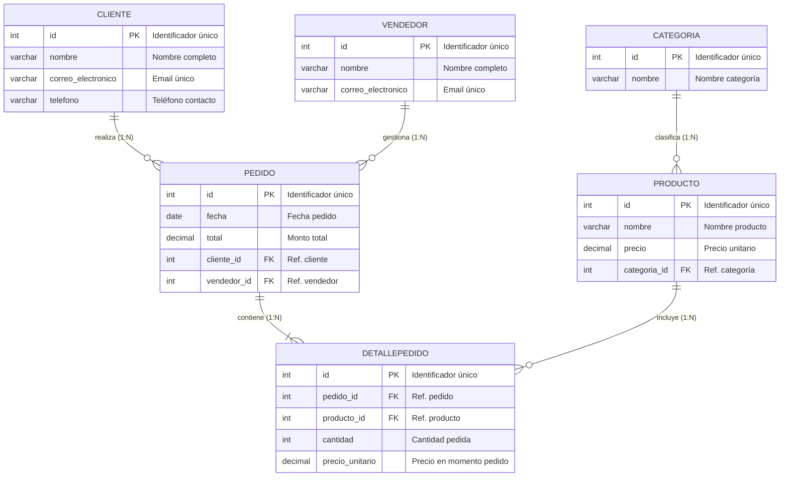

```mermaid
erDiagram
    CLIENTE {
        int id PK "Identificador único"
        varchar nombre "Nombre completo"
        varchar correo_electronico "Email único"
        varchar telefono "Teléfono contacto"
    }
    
    CATEGORIA {
        int id PK "Identificador único"
        varchar nombre "Nombre categoría"
    }
    
    PRODUCTO {
        int id PK "Identificador único"
        varchar nombre "Nombre producto"
        decimal precio "Precio unitario"
        int categoria_id FK "Ref. categoría"
    }
    
    VENDEDOR {
        int id PK "Identificador único"
        varchar nombre "Nombre completo"
        varchar correo_electronico "Email único"
    }
    
    PEDIDO {
        int id PK "Identificador único"
        date fecha "Fecha pedido"
        decimal total "Monto total"
        int cliente_id FK "Ref. cliente"
        int vendedor_id FK "Ref. vendedor"
    }
    
    DETALLEPEDIDO {
        int id PK "Identificador único"
        int pedido_id FK "Ref. pedido"
        int producto_id FK "Ref. producto"
        int cantidad "Cantidad pedida"
        decimal precio_unitario "Precio en momento pedido"
    }
    
    CLIENTE ||--o{ PEDIDO : "realiza (1:N)"
    VENDEDOR ||--o{ PEDIDO : "gestiona (1:N)"
    PEDIDO ||--|{ DETALLEPEDIDO : "contiene (1:N)"
    PRODUCTO ||--o{ DETALLEPEDIDO : "incluye (1:N)"
    CATEGORIA ||--o{ PRODUCTO : "clasifica (1:N)"
```